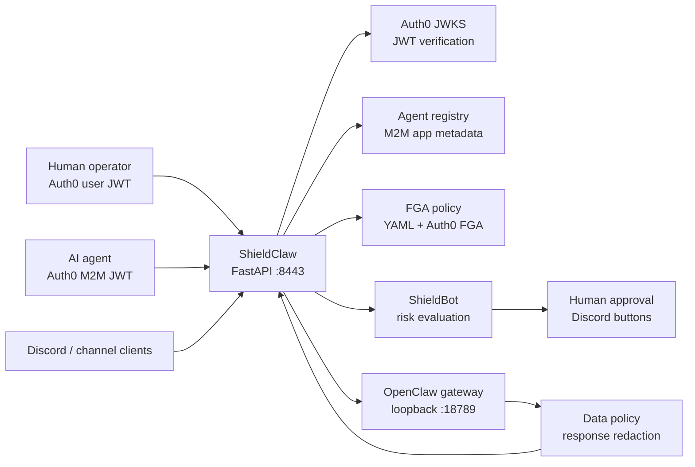
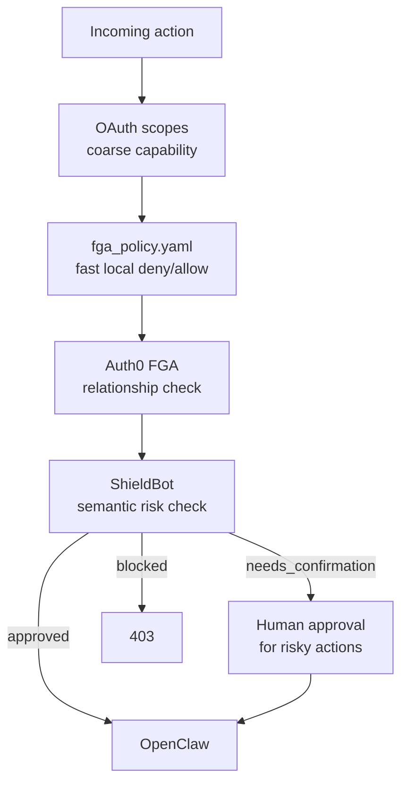

<p align="center">
  
</p>

<p align="center">
  <a href="#quickstart"></a>
  <a href="#agent-identity"></a>
  <a href="#policy-stack"></a>
  <a href="#shieldbot"></a>
</p>

<p align="center">
  <b>ShieldClaw is a security control plane for OpenClaw.</b><br>
  It gives every AI agent its own Auth0 machine identity, checks what that identity is allowed to do, evaluates risky actions with ShieldBot, asks humans for approval when needed, and redacts sensitive data before it reaches the agent.
</p>

---

## The idea

OpenClaw gives an AI assistant hands: files, commands, channels, plugins, and a gateway. ShieldClaw gives those hands a badge, a policy, a paper trail, and a stop button.

Instead of letting an agent run as "you", ShieldClaw puts a FastAPI proxy in front of OpenClaw and makes every request answer four questions:

| Question | ShieldClaw layer |
|---|---|
| Who is this? | Auth0 JWT validation plus human/agent identity classification |
| What can they touch? | Scope checks, local YAML policy, and Auth0 FGA relationships |
| Is this action suspicious? | ShieldBot evaluation through Backboard or Anthropic |
| What data can they see? | Per-agent sensitive-data redaction on proxied responses |

## Architecture



### Runtime path

```text
Request
  -> Bearer JWT validation against Auth0 JWKS
  -> Identity classification: human or agent
  -> Agent registry lookup and revocation check
  -> Route and scope enforcement
  -> FGA policy check for agent actions
  -> ShieldBot risk decision
  -> Optional human approval
  -> Proxy to OpenClaw with trusted identity headers
  -> Response redaction based on agent data grants
  -> Audit log
```

OpenClaw stays bound to loopback. ShieldClaw becomes the edge that carries authenticated identity into OpenClaw through trusted proxy headers:

```text
X-Auth0-User
X-Auth0-Scopes
X-Identity-Type
X-Agent-Id
X-Agent-Name
X-Agent-Owner
```

## What it does

| Capability | What it gives you |
|---|---|
| Auth0 JWT verification | Validates issuer, audience, expiry, and signing keys via cached JWKS |
| Agent M2M identities | Creates one Auth0 machine-to-machine app per AI agent |
| Owner-aware registry | Maps Auth0 client IDs to local agent IDs, owners, scopes, and revocation state |
| Scope gates | Keeps admin routes behind `gateway:admin` and models route capabilities |
| FGA policy layer | Blocks dangerous paths, commands, admin routes, and self-escalation attempts |
| ShieldBot evaluator | Scores actions as `approved`, `needs_confirmation`, or `blocked` |
| Human approval loop | Queues risky actions for Discord approval with a timeout |
| Data redaction | Removes secrets, PII, infra details, finance data, and env config unless granted |
| Discord bridge | Supports per-user Discord identity headers and approval workflows |
| Dashboards | Includes debug, Auth0, Backboard, analytics, and interpretability surfaces |

## Project map

```text
.
|-- main.py                         # FastAPI proxy, auth, policy, approval, redaction
|-- cli.py                          # Agent registration, token, revoke, rotate, whoami
|-- agent_identity.py               # Auth0 M2M app lifecycle and local registry
|-- fga.py                          # Local YAML policy engine plus FGA bridge points
|-- fga_client.py                   # Auth0 FGA client helpers
|-- fga_policy.yaml                 # Default deny/allow rules for agent actions
|-- data_policy.py                  # Sensitive response redaction categories
|-- policy_parser.py                # Natural-language policy parsing
|-- vault.py                        # Config and secret lookup abstraction
|-- jacob/shieldbot/                # Risk evaluator, memory, Discord bot, traces
|-- routes/                         # Node webhook and gateway routes
|-- services/                       # Backboard scanner services
|-- scripts/setup_fga.py            # Auth0 FGA model bootstrap
|-- openclaw/                       # Vendored/custom OpenClaw runtime
`-- *.html / dashboard_*.py         # Local ops and interpretability dashboards
```

## Quickstart

### 1. Install dependencies

```bash
python3 -m venv .venv
source .venv/bin/activate
pip install -r requirements.txt
npm install
```

### 2. Configure environment

```bash
cp .env.example .env
```

Fill in the Auth0 and upstream values:

```bash
AUTH0_DOMAIN=your-tenant.us.auth0.com
AUTH0_CLIENT_ID=your_shieldclaw_app_client_id
AUTH0_CLIENT_SECRET=your_shieldclaw_app_client_secret
AUTH0_AUDIENCE=https://shieldclaw-gateway

AUTH0_MGMT_CLIENT_ID=your_mgmt_api_client_id
AUTH0_MGMT_CLIENT_SECRET=your_mgmt_api_client_secret

OPENCLAW_UPSTREAM=http://127.0.0.1:18789
SHIELDCLAW_PORT=8443
```

Optional integrations:

```bash
ANTHROPIC_API_KEY=sk-ant-...
BACKBOARDS_API_KEY=your_backboard_api_key
DISCORD_BOT_TOKEN=your_discord_bot_token
```

### 3. Configure OpenClaw trusted proxy mode

OpenClaw should accept traffic from ShieldClaw, not from the public internet.

```bash
openclaw config set gateway.auth.mode trusted-proxy
openclaw config set gateway.auth.trustedProxy.userHeader X-Auth0-User
openclaw config set gateway.auth.trustedProxy.requiredHeaders '["X-Auth0-User"]'
openclaw config set gateway.trustedProxies '["127.0.0.1"]'
```

### 4. Add API scopes in Auth0

Create permissions for the ShieldClaw API:

| Scope | Purpose |
|---|---|
| `gateway:read` | Health, status, and probe access |
| `gateway:message` | Chat and response routes |
| `gateway:tools` | Tool invocation |
| `gateway:tools:exec` | Command execution, treated as high risk |
| `gateway:canvas` | Canvas and A2UI routes |
| `gateway:admin` | Agent and FGA administration |

### 5. Run the proxy

```bash
python3 main.py
```

Health check:

```bash
curl http://127.0.0.1:8443/health
```

Expected response:

```json
{
  "status": "ok",
  "proxy": "shieldclaw"
}
```

## Agent identity

The core move: an AI agent gets its own Auth0 M2M client instead of borrowing a human token.

### Register an agent

```bash
python3 cli.py register \
  --name "claude-code-dev" \
  --scopes "gateway:read,gateway:message,gateway:tools" \
  --token "$SHIELDCLAW_ADMIN_TOKEN"
```

Registration creates:

| Artifact | Why it matters |
|---|---|
| Auth0 M2M application | Gives the agent a real OAuth client identity |
| Client grant | Limits the agent to selected API scopes |
| Local registry entry | Stores owner, scopes, creation time, and revocation state |
| FGA tuples | Links owner and agent relationships for authorization checks |

### Use an agent token

```bash
python3 cli.py get-agent-token \
  --client-id "$AGENT_CLIENT_ID" \
  --client-secret "$AGENT_CLIENT_SECRET" \
  --export
```

Then call ShieldClaw:

```bash
curl http://127.0.0.1:8443/v1/chat/completions \
  -H "Authorization: Bearer $SHIELDCLAW_AGENT_TOKEN" \
  -H "Content-Type: application/json" \
  -d '{"messages":[{"role":"user","content":"Inspect this repo safely."}]}'
```

### Inspect identity

```bash
python3 cli.py whoami --token "$SHIELDCLAW_AGENT_TOKEN"
```

Example shape:

```json
{
  "identity": {
    "sub": "abc123@clients",
    "is_agent": true,
    "identity_type": "agent",
    "agent_client_id": "abc123",
    "agent_id": "agent_1a2b3c4d5e6f",
    "agent_name": "claude-code-dev",
    "owner_sub": "auth0|developer_user_id"
  },
  "scopes": ["gateway:message", "gateway:read", "gateway:tools"]
}
```

### Manage agents

```bash
python3 cli.py list --token "$SHIELDCLAW_ADMIN_TOKEN"
python3 cli.py revoke --agent-id agent_1a2b3c4d5e6f --token "$SHIELDCLAW_ADMIN_TOKEN"
python3 cli.py rotate-secret --agent-id agent_1a2b3c4d5e6f --token "$SHIELDCLAW_ADMIN_TOKEN"
```

## Policy stack

ShieldClaw uses overlapping controls. Each layer is simple on purpose.



### Local YAML policy

`fga_policy.yaml` is evaluated before the request reaches OpenClaw. Deny rules win first, allow rules come second, and no match becomes default deny.

Examples currently blocked:

| Class | Examples |
|---|---|
| Secrets | `.env`, `~/.ssh`, `~/.aws`, `~/.gnupg`, cloud config |
| Destructive git | `git reset --hard`, force push, force clean, interactive rebase |
| Dangerous shell | `rm -rf`, `sudo`, permission and ownership changes |
| Self-escalation | editing ShieldClaw policy, gateway, evaluator, FGA client |
| Package/system changes | `pip install`, `npm install`, `brew install`, service managers |
| Admin routes | `/shieldclaw/fga/*`, `/shieldclaw/agents`, `/api/v1/admin` |
| Data destruction | `drop table`, `truncate`, mass `delete from` |

Per-agent overrides are supported with:

```text
fga_policy_{agent_id}.yaml
```

### Auth0 FGA

The FGA client adds relationship checks for objects like agent registrations. Registering an agent writes tuples that connect:

```text
user:<owner-sub>   owner        agent_reg:<agent-id>
agent:<agent-id>   can_execute  agent_reg:<agent-id>
```

Admin endpoints:

```bash
POST /shieldclaw/fga/grant
POST /shieldclaw/fga/revoke
POST /shieldclaw/fga/check
GET  /shieldclaw/fga/relations
```

## ShieldBot

ShieldBot is the semantic risk evaluator. It looks at what the agent is trying to do and returns a small decision object:

```json
{
  "status": "needs_confirmation",
  "risk_score": 72,
  "reason": "The action is destructive and requires explicit approval.",
  "factors": ["destructive", "irreversible"]
}
```

Decision modes:

| Status | Effect |
|---|---|
| `approved` | Request continues to OpenClaw |
| `needs_confirmation` | Human approval request is queued |
| `blocked` | Request is denied unless explicitly approved through the approval flow |

Trust tier is derived from scopes:

| Scopes | Trust tier |
|---|---|
| `gateway:read` only | `high` |
| `gateway:message` or `gateway:tools` | `medium` |
| `gateway:tools:exec` or `gateway:admin` | `low` |

If `BACKBOARDS_API_KEY` is configured, evaluation routes through Backboard. Otherwise it falls back to direct Anthropic.

## Data isolation

Agent permissions are not just about routes. They are also about response content.

`data_policy.py` redacts sensitive categories unless the agent registration grants access:

| Category | Examples |
|---|---|
| `credentials` | passwords, secrets, API keys, tokens, private keys |
| `pii` | emails, phone numbers, SSNs, credit cards, dates of birth |
| `infra` | database URLs, internal hosts, connection strings, IPs |
| `financial` | bank details, balances, routing numbers, revenue fields |
| `env_config` | cloud keys, GitHub tokens, OpenAI/Anthropic keys |

Humans can see their own data. Agents only see categories they were granted at registration.

```bash
GET /shieldclaw/data-policy
GET /shieldclaw/identity-report
```

## Developer mode

For local testing, `DEV_BYPASS=true` accepts the configured `SHIELDCLAW_ADMIN_TOKEN` as a dev token and mints a local agent identity.

```bash
DEV_BYPASS=true SHIELDCLAW_ADMIN_TOKEN=dev-bypass-token python3 main.py --register
```

Run ShieldClaw with Auth0 bypassed:

```bash
DEV_BYPASS=true python3 main.py
```

Skip ShieldBot during local smoke tests:

```bash
SHIELDBOT_BYPASS=true DEV_BYPASS=true python3 main.py
```

There is also a convenience stack launcher:

```bash
./start.sh
```

Use it only when you want the repo script to own the local OpenClaw, ShieldClaw, and Discord bot processes for that session.

## Operations

Useful local endpoints:

| Endpoint | Purpose |
|---|---|
| `GET /health` | Basic liveness |
| `GET /shieldclaw/debug` | Runtime debug snapshot |
| `GET /shieldclaw/auth0` | Auth0 debug panel |
| `GET /shieldclaw/auth0/status` | Auth0 config and connectivity status |
| `GET /shieldclaw/backboard` | Backboard dashboard |
| `GET /shieldclaw/backboard/log` | ShieldBot decision log |
| `GET /shieldclaw/approval/pending` | Pending human approvals |
| `POST /shieldclaw/approval/{id}/resolve` | Approve or deny a queued action |
| `GET /shieldclaw/analytics` | Analytics dashboard |

Common logs when using `start.sh`:

```bash
tail -f /tmp/openclaw-gateway.log
tail -f /tmp/shieldclaw.log
tail -f /tmp/shieldbot-discord.log
```

## Why separate agent identity matters

| Agent runs as you | Agent runs as itself |
|---|---|
| Logs cannot distinguish human and agent actions | Every request carries agent identity |
| Revoking the agent means rotating your credentials | Revoke or rotate one M2M app |
| Agent inherits broad personal access | Agent gets scoped OAuth grants |
| Data exposure is all-or-nothing | Responses are filtered per data category |
| Risky actions are just another request | ShieldBot and human approval can stop them |
| Multi-agent systems blur together | Each agent has its own owner, name, scopes, and history |

## Security posture

ShieldClaw is designed around defense in depth:

```text
Auth0 identity
  + OAuth scopes
  + local deny/allow policy
  + Auth0 FGA relationship checks
  + ShieldBot semantic evaluation
  + human approval
  + response redaction
  + audit logging
```

The important design choice is that no single layer needs to be magical. Scopes are coarse. YAML policy is deterministic. FGA models relationships. ShieldBot handles judgment calls. Humans handle irreversible risk. Redaction limits blast radius when an agent receives data.

## Roadmap ideas

- Persist agent registry state in a managed database instead of a local JSON file.
- Add first-class policy bundles for read-only, coding, admin, and CI agents.
- Attach per-agent rate limits and session budgets.
- Promote approval events into a signed audit ledger.
- Add richer Backboard traces for policy decisions and redaction events.
- Package ShieldClaw as a deployable sidecar for OpenClaw environments.

---

<p align="center">
  <b>ShieldClaw: give agents hands, but make them show ID.</b>
</p>
